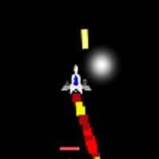
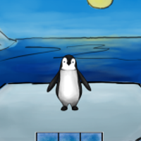

## About me
My name is Patryk Walicki, also known as Walik.
I am a programmer and a video game developer, based in Warsaw, Poland.
I am currently studying Computer Science on Warsaw Politechnika.

**Skills**
- Unity3D/C#
- C++
- Git

**Contact info:**

[Email](patrykwalikwalicki@gmail.com)

[Facebook](https://www.facebook.com/patryk.walicki.9)

**My profiles all over the internet**

[LinkedIn](https://www.linkedin.com/in/patryk-walicki-7b9426153/)

[Itch.io](https://walik.itch.io/)

[Github](github.com/PWalik)

[Bitbucket](https://bitbucket.org/Walik/)

## My projects

  **[Miners vs Aliens](https://ixi.itch.io/gornicy-vs-obcy)**
  
  
  
  Made in a 4 -person group during Film Jam 2017, was a gameplay programmer. Character-based shooter where you battle with aliens
  as Polish Silesian Miners.

  **[Meter](https://walik.itch.io/meter)**
  
  
  
  Made solo during Slavic Game Jam 2017. Action game about hacking parkmeters as a gremlin
  to steal people's personal info.

  **[Starship](https://walik.itch.io/starship)**
  
  
  
  Made solo during Slavic Game Jam 2016. 90s - inspired arcade twin stick shooter, 
  where your main goal is to destroy every enemy planet on the level.

  **[Penguins Galore](https://globalgamejam.org/2016/games/penguins-galore)**
  
  
  
  Made in a 3 -person group during Global Game Jam 2016, was a main programmer. Memory puzzle game, 
  where you help one brave penguin fight of global warming.
